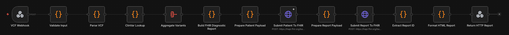

# Clinical Genomics ETL: VCF to FHIR R4 Pipeline


A scalable, automated ETL (Extract, Transform, Load) pipeline for ingesting somatic and germline variant data from Variant Call Format (VCF) files, enriching them against NCBI ClinVar, and posting the structured variants to a FHIR R4 repository.

This project is built using [n8n](https://n8n.io) as the orchestration engine, defined entirely in declarative TypeScript using `n8n-as-code`.

## Workflow Snapshots
*Replace this placeholder with a screenshot of the n8n canvas once imported.*


## Architecture Overview

The pipeline executes the following high-level processes:
1. **Intake (Webhook)**: Receives clinical payloads containing `vcf_content`, `patient_id`, and `sample_id`.
2. **Validation & Extraction**: Normalizes VCF payloads (handling GRCh37/GRCh38 builds) and extracts chromosomal variants (CHROM, POS, REF, ALT, FILTER).
3. **Clinical Enrichment**: Interrogates the NCBI Entrez E-utilities API to look up each variant's ClinVar UID and pathogenic significance.
4. **Data Aggregation**: Aggregates the asynchronous variant lookups into a unified payload for the next step.
5. **FHIR Translation (HL7 Genomics Reporting)**: 
    - Maps variants to LOINC codes (e.g., `69548-6` for Genetic variant assessment).
    - Constructs an HL7-compliant `DiagnosticReport` bundle containing individual `Observation` resources.
6. **Data Loading**: Posts the FHIR Transaction Bundle to an external HAPI FHIR server.
7. **Reporting & Logging**: 
    - Renders a visually accessible HTML clinical report returned synchronously via HTTP.

## Features

- **Asynchronous Variant Resolution**: Ensures NCBI rate limits are respected without dropping variants.
- **Standards-based**: Implements the HL7 FHIR Genomics Reporting Implementation Guide (IG).
- **Error Resiliency**: Contains a robust global error-trigger routing with detailed logging.
- **Automated Clinical Reporting**: Dynamically generates HTML reports suitable for immediate clinical review.

## Prerequisites

- An active **n8n** deployment (v1.x+).
- An **NCBI API Key** (optional, but recommended to avoid aggressive rate limiting).
- A **FHIR R4 Server** (e.g., HAPI FHIR, Google Cloud Healthcare API).

## Sample Output (HTML Report)

The pipeline dynamically generates and returns a lightweight, stylized clinical report directly in the webhook response.

## Repository Structure

- `src/Clinical_Genomics_ETL.workflow.ts` - The primary n8n-as-code TypeScript definition of the pipeline.
- `src/nodes/` - Extracted JavaScript logic for individual nodes.

## Deployment

This workflow is managed via `n8n-as-code`. To deploy it to your local n8n instance:

```bash
npm install -g @n8n-as-code/cli
n8nac push src/Clinical_Genomics_ETL.workflow.ts
```

Alternatively, you can import the raw `workflow.json` file directly into your n8n workspace UI.

## License

This project is open-source and available under the MIT License.